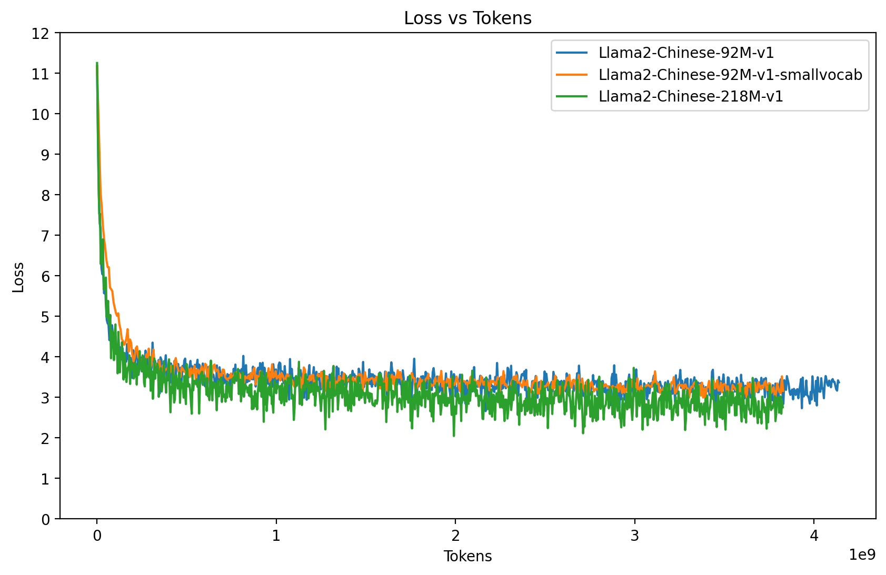
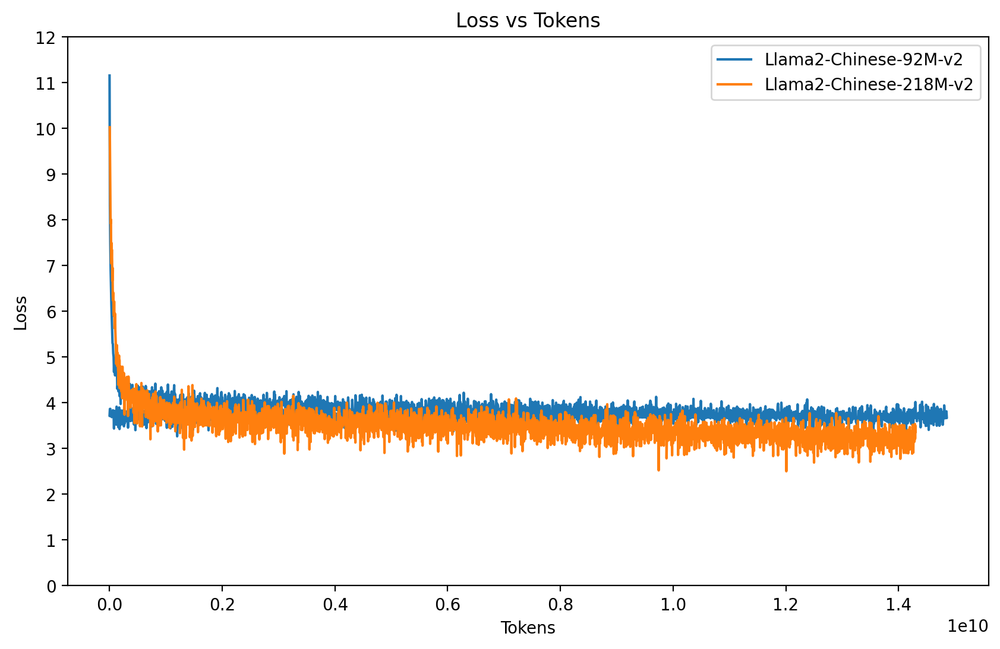

# Baby-Llama2-Chinese
Created by Limzero & Ambrose
## 📝介绍
本项目致力于构建一个小参数量的中文Llama2仓库。

包含：预训练、SFT指令微调、**奖励模型以及强化学习**（待做）完整流程。

除此之外，本项目还会梳理一套完整的LLM学习资料（正在进行中）。

希望该开源项目可以帮助LLM初学者以最快速度入门！

## 📚项目愿景
- 收集并汇总中文预训练语料，训练一个参数量500M-1B的Llama2-Chinese预训练模型，并在某个垂直领域可以表现不错
- 构建包含预训练、SFT指令微调、奖励模型以及强化学习整个完整流程的LLM代码仓库，包含DeepSpeed、Megatron等分布式训练技术
- 知识分享：梳理一套完整的LLM学习资料

## 🌟Quick Start
```bash
# 1. 从“Baby-llama2-chinese Corpus”的百度网盘中下载分词处理后的预训练语料。（按需求下载-共634亿tokens，文件总大小为118G）
# 2. 将下载好的数据放到./data/目录下
# 3. 根据下载的语料，修改data_process.py中的data_path_list部分
# 4. 运行data_process.py，在./data/目录下生成pretrain_data.bin文件
python data_process.py
# 5. 根据自身算力，修改 pretrain.py文件中的模型参数调整模型大小（max_seq_len、dim、n_layers、n_heads），如果爆显存可以调整batch_size参数
# 6. 预训练 pretrain.py——以下示例是基于4*3090
screen -S ambrose    #(创建新的名称为ambrose的screen)
screen -r ambrose    #(进入名称为ambrose的screen)
torchrun --standalone --nproc_per_node=4 pretrain.py
# 7. 运行结束后，预训练模型会保存在out/pretrain文件夹中
# 8. 针对alpaca-zh和bell两个SFT语料进行处理，如果新加SFT语料可以自行扩展。运行sft_data_process.py
python sft_data_process.py
# 9. 运行结束后，会在./sft_data目录下产生sft_data.csv文件
# 10. SFT微调
python sft.py
# 11. 运行结束后，SFT模型会保存在‘out/sft’文件夹中

# 12. 如果需要测试训练好的SFT模型，可以运行eval.py。（可以自定义问题）
python eval.py
```

## 📢 更新公告
- 2024年01月24日：新增了在84亿tokens预训练语料上的两个新模型Llama2-Chinese-92M-v1-smallvocab与Llama2-Chinese-218M-v1，与Llama2-Chinese-92M-v1进行对比分析模型大小和词表大小对预训练效果的影响！
- 2024年02月29日：新增了在634亿tokens预训练语料上的模型Llama2-Chinese-218M-v3，并以此为基座，使用医学垂直领域SFT数据进行finetune得到模型Llama2-Chinese-218M-v3-MedicalChat

## 🤖预训练
一个好的预训练基座模型要具备**续写**的能力。
1. **分词器（Tokenizer）**：LLM分词器的构建方式有两种：一种是自己构造词表并训练一个分词器[custom tokenizers](https://github.com/karpathy/llama2.c)，另一种是选择开源模型训练好的分词器，例如ChatGLM2-6B，Llama2等。

   由于llama官方所提供的词表中，中文的部分只有700个，这也是llama中文能力聊胜于无的原因。因此，为了方便使用，本项目选择[ChatGLM2-6B](https://github.com/THUDM/ChatGLM2-6B)的分词器，该词表大小为64793，值得注意的是：这是一个很妙的数字，因为它刚好在uint16的表示范围（0～65535的无符号整数），每一个token只需要两个字节即可表示，当我们的语料较大时候，相比常用的int32可以节省一半的存储空间。

2. **预训练语料（Corpus for pre-training ）**：从LLM技术革命以来，开源中文预训练语料越来越多。本项目本着拾人牙慧的精神，收集并处理了以下几个经典数据集：
      
   | 中文预训练语料                                                                                                                                                                                                                    | 描述                                                            |
   |----------------------------------------------------------------------------------------------------------------------------------------------------------------------------------------------------------------------------|---------------------------------------------------------------|
   | Wiki中文百科：[wikipedia-cn-20230720-filtered](https://huggingface.co/datasets/pleisto/wikipedia-cn-20230720-filtered)                                                                                              | 中文Wikipedia的数据                                                |
   | BaiduBaiKe：[百度网盘](https://pan.baidu.com/s/1jIpCHnWLTNYabftavo3DVw?pwd=bwvb) 提取码: bwvb                                                                                                                                      | 中文BaiduBaiKe的数据                                               |
   | C4_zh：[百度网盘 part1](https://pan.baidu.com/s/18O2Tj_PPB718K8gnaWrWUQ) 提取码：zv4r；[百度网盘 part2](https://pan.baidu.com/s/11PTgtUfFXvpNkOige9Iw4w) 提取码：sb83；[百度网盘 part3](https://pan.baidu.com/s/1248QfTS8QHPojYW-0fd5jQ) 提取码：l89d | C4是可用的最大语言数据集之一，收集了来自互联网上超过3.65亿个域的超过1560亿个token。C4_zh是其中的一部分 |
   | WuDaoCorpora：[智源研究院BAAI：WuDaoCorpora Text文本预训练数据集](https://data.baai.ac.cn/details/WuDaoCorporaText)                                                                                                                       | 中文悟道开源的200G数据                                                 |
   | shibing624/medical：[shibing624/medical](https://huggingface.co/datasets/shibing624/medical/tree/main)                                                                                                          | 源自shibing624的一部分医学领域的预训练数据                                    |

同时，为了给大家节省数据预处理的时间，本项目开源了经过ChatGLM2-6B的分词器处理后的预训练语料，共计**634亿Tokens**的数据量，链接如下：[Baby-llama2-chinese Corpus](https://pan.baidu.com/s/18o4gF-G68qfgOGWQXgAg3g) 提取码：6unr。将下载好的数据放到./data目录下即可。

【考虑到作者所持有机子的局限性（4张3090），目前634亿Tokens的预训练语料+300M参数量的模型已经是本人预训练的极限-注：没有使用DeepSpeed、Megatron等分布式训练架构】

### 预训练语料预处理
数据预处理采取GPT的通用做法，对语料进行提前分词，对一个样本做完分词后在末尾加上一个结束符号`<eos>`，与下一个样本区分开。然后将所有的训练语料拼接成一个数组（np.uint16）以.bin二进制格式存储到磁盘上。如果语料过大，避免内存溢出，可以选择mmap格式。
```bash
#脚本里面每一个函数对应一个语料库的预处理，搭建新加语料可以自行扩展。
python data_process.py
#运行结束后，会在./data目录下产生pretrain_data.bin文件
```
### 预训练
```bash
#考虑到预训练的运行时间非常久，需要采用程序后台运行的措施，本项目提供一种常用的程序后台运行的操作：
screen -S ambrose    #(创建新的名称为ambrose的screen)
screen -r ambrose    #(进入名称为ambrose的screen)
#在该screen下执行预训练代码，如果你有四张卡，则nproc_per_node设置为4
torchrun --standalone --nproc_per_node=4 pretrain.py
#运行结束后，预训练模型会保存在‘out/pretrain’文件夹中
```
   
## 💡SFT指令微调
LLM微调的目的是将预训练模型中的知识引导出来的一种手段，通俗的讲就是教会模型说人话。
1. **微调方法**：自然语言处理目前存在一个重要的范式：一般领域数据的大规模预训练，对特定任务或领域的适应。因此，为了让预训练模型在特定任务或领域有不错的表现，需要对模型进行微调。目前主流的四种微调方法如下：

   ### LLM微调方法
   - **全面微调（Full Fine-tuning）**：使用任务特定数据调整LLM的所有参数。
   - **参数高效精细调整（Parameter Efficient Fine-tuning）**：修改选定参数以实现更高效的适应。例如：LoRA、Adapter、Prefix-tuning、P-tuning以及P-tuning v2。
   - **提示工程（Prompt Engineering）**：改进模型输入以指导模型输出理想结果。
   - **检索增强生成（Retrieval Augmented Generation）**：将提示工程与数据库查询结合，以获得丰富的上下文答案。

   其中Full Fine-tuning和Parameter Efficient Fine-tuning是需要基于特定任务或者垂直领域数据对模型（全部 or 部分）参数进行微调；
   Prompt Engineering和Retrieval Augmented Generation是通过设计模型输入的template，引导模型输出我们想要的内容，不需要对模型参数进行微调。其中RAG是通过外挂数据库的方式，为模型提供领域知识输入。

   由于本项目模型参数（仅有218M左右，与bert-large-340M参数量差不多）并不大，因此选择Full Fine-tuning对特定任务或领域数据进行微调。后续有更大的预训练模型会补充其他微调方法。
2. **SFT微调数据**：LLM在垂直领域的适应已经是2023年的主格调，因此各个领域的SFT语料和微调模型层出不穷。目前已经有大佬整理并持续更新这方面的[最新进展](https://github.com/HqWu-HITCS/Awesome-Chinese-LLM)，大家有需要可以自己访问。
   
   本项目主要针对两类SFT语料进行模型微调，如下：
      
   **日常问答SFT数据**：

   | SFT语料                                                                       | 描述                                                                  |
   |-----------------------------------------------------------------------------|---------------------------------------------------------------------|
   | alpaca-zh：[alpaca-zh](https://huggingface.co/datasets/shibing624/alpaca-zh) | 源自shibing624的一部分SFT数据。该数据集是参考Alpaca方法基于GPT4得到的self-instruct数据，约5万条。 |
   | bell：[bell](https://huggingface.co/datasets/BelleGroup/train_1M_CN)         | 源自BelleGroup的一部分SFT数据。包含约100万条由BELLE项目生成的中文指令数据。|

   **医学垂直领域SFT数据**：
         
   | SFT语料                                                                                                                    | 描述                                                                                                                        |
   |--------------------------------------------------------------------------------------------------------------------------|---------------------------------------------------------------------------------------------------------------------------|
   | shibing624/medical：[shibing624/medical](https://huggingface.co/datasets/shibing624/medical/tree/main)        | 源自shibing624。该数据集不仅包含了预训练语料如上文所述，还包含一部分SFT数据。                                                                             |
   | HuatuoGPT-sft-data-v1：[HuatuoGPT-sft-data-v1](https://huggingface.co/datasets/FreedomIntelligence/HuatuoGPT-sft-data-v1) | 源自HuatuoGPT的SFT数据                                                                                                         |
   | DISC-Med-SFT：[HuatuoGPT-sft-data-v1](https://huggingface.co/datasets/Flmc/DISC-Med-SFT) | DISC-Med-SFT Dataset的子集                                                                                                   |
   | ChatMed_Consult-v0.3：[michaelwzhu/ChatMed_Consult-v0.3](https://huggingface.co/datasets/michaelwzhu/ChatMed_Consult_Dataset) | 本数据集, ChatMed-Dataset, 中的query(或者是prompt)来自于互联网上的医疗问诊问题(549,326)，反映了真实世界的不同用户/患者的医疗问诊需求。目前response都是由OpenAI GPT-3.5引擎回答的。 |

### SFT样本构建
因为SFT语料一般较小，我们没必要提前分词，而是在构建Dataloader的时候进行分词构建batch送给模型。所以自行参考dataset_sft.py即可！

基本逻辑如下：
- prompt和answer之间一定要有一个开始符`<bos>`隔开，然后answer后需要一个结束符`<eos>`。
- 计算loss的时候，对prompt部分的loss进行mask，只计算answer部分的loss即可。

```bash
#脚本里面针对alpaca-zh和bell两个SFT语料进行处理，搭建新加SFT语料可以自行扩展。
python sft_data_process.py
#运行结束后，会在./sft_data目录下产生sft_data.csv文件
```
### 全面微调（Full Fine-tuning）
```bash
#微调所需时间一般较短，如需要后台运行，本项目提供一种常用的程序后台运行的操作：
screen -S ambrose    #(创建新的名称为ambrose的screen)
screen -r ambrose    #(进入名称为ambrose的screen)
#在该screen下执行微调代码
python sft.py
#运行结束后，SFT模型会保存在‘out/sft’文件夹中
```

## 🥇模型权重以及评测
1. **预训练模型**
   
   | 模型名称                                                        | 预训练语料                                                      | 🤗模型参数                                                  | 下载地址                                                            |
   |-------------------------------------------------------------|------------------------------------------------------------|---------------------------------------------------------|-----------------------------------------------------------------|
   | Llama2-Chinese-92M-v1                                       | （82.78亿 Tokens）<br/>Wiki中文百科<br/>+BaiduBaiKe<br/>+shibing624/medical     | max_seq_len=512<br/>dim=512<br/>n_layers=8<br/>n_heads=8    | [模型下载](https://pan.baidu.com/s/14hwHVvv_5YrIrJg2NWI62g)提取码：da7h |
   | Llama2-Chinese-92M-v2                                       | （140亿 Tokens）<br/>Wiki中文百科<br/>+BaiduBaiKe<br/>+shibing624/medical<br/>+C4_zh | max_seq_len=512<br/>dim=512<br/>n_layers=8<br/>n_heads=8    | [模型下载](https://pan.baidu.com/s/1slimqUbDsnChqFY3CsybVw)提取码：bjal |
   | Llama2-Chinese-92M-v1-smallvocab<br/>**Notes:vocab size:21131** | （82.78亿 Tokens）<br/>Wiki中文百科<br/>+BaiduBaiKe<br/>+shibing624/medical     | max_seq_len=512<br/>dim=512<br/>n_layers=8<br/>n_heads=8    | [模型下载](https://pan.baidu.com/s/1bKtAo8MBlDur6JIDW5cSYg)提取码：ttst |
   | Llama2-Chinese-218M-v1                                      |（82.78亿 Tokens）<br/>Wiki中文百科<br/>+BaiduBaiKe<br/>+shibing624/medical     | max_seq_len=1024<br/>dim=1024<br/>n_layers=12<br/>n_heads=8 | [模型下载](https://pan.baidu.com/s/1wLVGFbT4OF4LG2E8Ymf6VA)提取码：c10m |
   | Llama2-Chinese-218M-v2                                      | （140亿 Tokens）<br/>Wiki中文百科<br/>+BaiduBaiKe<br/>+shibing624/medical<br/>+C4_zh | max_seq_len=1024<br/>dim=1024<br/>n_layers=12<br/>n_heads=8 | [模型下载](https://pan.baidu.com/s/1cud_kEyRpXLR74DTRvqjGQ)提取码：dkne | 
   | Llama2-Chinese-218M-v3                                      | （634亿 Tokens）<br/>Wiki中文百科<br/>+BaiduBaiKe<br/>+shibing624/medical<br/>+C4_zh<br/>+WuDaoCorpora | max_seq_len=1024<br/>dim=1024<br/>n_layers=12<br/>n_heads=8 | [模型下载](https://pan.baidu.com/s/1-Zd0uBUY23lCvr5s_QSwwg)提取码：tpyy  |

### 各个预训练模型效果对比
预训练loss可视化展示：

预训练语料v1：（82.78亿 Tokens） Wiki中文百科 + BaiduBaiKe + shibing624/medical

对比模型说明：**Llama2-Chinese-92M-v1** vs **Llama2-Chinese-92M-v1-smallvocab** vs **Llama2-Chinese-218M-v1**

预训练语料v2：（140亿 Tokens） Wiki中文百科 + BaiduBaiKe + shibing624/medical + C4_zh

对比模型说明：**Llama2-Chinese-92M-v2** vs **Llama2-Chinese-218M-v2**

预训练语料v3：（634亿 Tokens） Wiki中文百科 + BaiduBaiKe + shibing624/medical + C4_zh + WuDaoCorpora

对比模型说明：**Llama2-Chinese-218M-v3**

主要从**续写能力**的角度对比各个预训练模型：
```bash
#预训练模型的推理：eval_pretrain.py。
python eval_pretrain.py
```

```bash
#示例一：Input：‘床前明月光，疑是地上霜。举头望明月，’
Llama2-Chinese-92M-v1 response：‘倚阑干照斜阳。● 早春何处无天，谁将归家归。谁愿去依花向，谁来教谁回。● 玉泉何处无玉泉，碧水如莲开处。何处何许何许人，何许何何何许地。● 青山里，春色深，月色寒。月影轻，春草凉。月来斜阳，雨声稀’
Llama2-Chinese-92M-v2 response：‘却见天涯何处无。3、 想问你为什么对我这么好？1、 你是否在问自己，我为什么一直爱你？2、我对你有多好？3、 我是谁？ 4、 我是谁？ 5、 为什么我从来都不像你。’
Llama2-Chinese-218M-v1 response：‘低头思故乡。2． 泪眼相对愁成丝，眉梢泪滴泪自流。3． 斜阳外，落花深似海。4． 泪眼横飞心易碎， 千言难答是何许？ 梦不成, 泪洒江天。5． 泪眼空， 伤心无处诉， 思君如忆君，泪自流。6． 泪雨声、’
Llama2-Chinese-218M-v2 response：‘低头思故乡。遥知兄弟登高处，遍插茱萸少一人。注释1、明月光：月光是秋天的明丽之色。清秋：秋季。2、知月与明影：见 知月与明影，比喻知识 知识 知识 知识 知识 知识 知识 知识 知识 秋之明影。唐·韩愈《祭李太白》诗：“一树秋光满 关’
Llama2-Chinese-218M-v3 response：‘低头思故乡。人生如风，风雨来时裹住风，风雨后时披着雨。世事茫茫难料，世间万物皆随波逐流。人生如梦，醒与醉随人自个儿。人生如风，风起时能吹动树枝摇摆不定;人生如梦，梦醒时却依然在梦乡挣扎。人生如风，风狂时能翻滚浪涛，风雨中仍能’

#示例二：Input：‘《小王子》是一本畅销童话书，它讲述了：’
Llama2-Chinese-92M-v1 response：‘小王子和他的公主的故事，讲述的是一个善良、勇敢、智慧、善良的小男孩，他们之间的爱情、友情，他们之间的亲情，他们的爱情、友情，他们之间的情感，他们之间的故事，最后的故事……《小王子》以漫画的形式把小王子和善良可爱的小公主的故事呈现给读者，相信大家一定可以从中领略到小王子和公主的故事带来的乐趣，从中体会到小王子的人生真谛。。内容简介：《小王子:小王子》故事 ’
Llama2-Chinese-92M-v2 response：‘我有一座神奇的城堡。我有一个神奇的故事；我有一个美丽的童话；我有一个可爱的童话；我有一个神奇的童话。“书虫 好书 书品 美书” 内容简介： 当阅读完了“书虫，好书，书品美书”，你一定感到你读出来的书比读一本书的好；当你看完了“书虫，好书” 最后，你会发现，书的世界竟是这么地广阔……本书中的所有童话童话，都是这样一’
Llama2-Chinese-218M-v1 response：‘小王子和他的伙伴——小丑们要和人类结缘。在他们的帮助下，小王子又遇到了各种怪事，小丑们又碰来了各种奇遇，他不仅救出了人类，还帮助了人类，还救出许多小王子。小王子和孩子们一起，和孩子们一起成长，一起冒险……书中的故事内容丰富，充满了乐趣……孩子们在阅读的过程中，将会逐渐熟悉并喜爱各种神奇的东西，同时也发现许多奇妙的趣事。’
Llama2-Chinese-218M-v2 response：‘小王子和他的伙伴们在森林里玩耍。他们遇见了很多小动物，可是它们却都讨厌他们。小王子想让小动物们开心，所以要去找小动物们开心……本书故事情节生动，内容丰富多彩，非常适合小朋友阅读。《小王子》的插画很特别，除了小王子外，还有灰姑娘、爱莎、小矮人、灰姑娘、丑小鸭……’
Llama2-Chinese-218M-v3 response：‘小王子去森林探望父亲。森林中发生了很多有趣的事情，可是小王子却非常不高兴，因为小树不见了，小树被埋了地底下。小树死了，小王子非常伤心。小王子想出许多办法来把树救出来，可是树好像一点也没死掉，它又跑到森林中央去。小树被埋在沙堆里了，可是小树并没有死，小王子觉得小树好像很关心他们，便’
```
2. **微调模型**
   
   | 模型名称                               | SFT语料                                                                                     | 🤗模型参数                                          | 下载地址                                                            |
   |------------------------------------|-------------------------------------------------------------------------------------------|-------------------------------------------------|-----------------------------------------------------------------|
   | Llama2-Chinese-92M-v1-NormalChat   | alpaca-zh+bell                                                                            | max_seq_len=512<br/>dim=512<br/>n_layers=8<br/>n_heads=8    | [模型下载](https://pan.baidu.com/s/14hwHVvv_5YrIrJg2NWI62g)提取码：da7h |
   | Llama2-Chinese-92M-v1-MedicalChat  | shibing624/medical<br/>+HuatuoGPT-sft-data-v1<br/>+DISC-Med-SFT<br/>+ChatMed_Consult-v0.3 | max_seq_len=512<br/>dim=512<br/>n_layers=8<br/>n_heads=8    | [模型下载](https://pan.baidu.com/s/14hwHVvv_5YrIrJg2NWI62g)提取码：da7h |
   | Llama2-Chinese-92M-v2-NormalChat   | alpaca-zh+bell                                                                            | max_seq_len=512<br/>dim=512<br/>n_layers=8<br/>n_heads=8    | [模型下载](https://pan.baidu.com/s/1slimqUbDsnChqFY3CsybVw)提取码：bjal |
   | Llama2-Chinese-92M-v2-MedicalChat  | shibing624/medical<br/>+HuatuoGPT-sft-data-v1<br/>+DISC-Med-SFT<br/>+ChatMed_Consult-v0.3 | max_seq_len=512<br/>dim=512<br/>n_layers=8<br/>n_heads=8    | 正在加紧训练中！！！                                                      |
   | Llama2-Chinese-218M-v1-NormalChat  | alpaca-zh+bell                                                                            | max_seq_len=1024<br/>dim=1024<br/>n_layers=12<br/>n_heads=8 | 正在加紧训练中！！！                                                      |
   | Llama2-Chinese-218M-v1-MedicalChat | shibing624/medical<br/>+HuatuoGPT-sft-data-v1<br/>+DISC-Med-SFT<br/>+ChatMed_Consult-v0.3 | max_seq_len=1024<br/>dim=1024<br/>n_layers=12<br/>n_heads=8 | 正在加紧训练中！！！                                                      |
   | Llama2-Chinese-218M-v2-NormalChat  | alpaca-zh+bell                                                                            | max_seq_len=1024<br/>dim=1024<br/>n_layers=12<br/>n_heads=8 | [模型下载](https://pan.baidu.com/s/1cud_kEyRpXLR74DTRvqjGQ)提取码：dkne |
   | Llama2-Chinese-218M-v2-MedicalChat | shibing624/medical<br/>+HuatuoGPT-sft-data-v1<br/>+DISC-Med-SFT<br/>+ChatMed_Consult-v0.3 | max_seq_len=1024<br/>dim=1024<br/>n_layers=12<br/>n_heads=8 | 正在加紧训练中！！！                                                      |
   | Llama2-Chinese-218M-v3-NormalChat  | alpaca-zh+bell                                                                            | max_seq_len=1024<br/>dim=1024<br/>n_layers=12<br/>n_heads=8 | 正在加紧训练中！！！                                                      |
   | Llama2-Chinese-218M-v3-MedicalChat | shibing624/medical<br/>+HuatuoGPT-sft-data-v1<br/>+DISC-Med-SFT<br/>+ChatMed_Consult-v0.3 | max_seq_len=1024<br/>dim=1024<br/>n_layers=12<br/>n_heads=8 | [模型下载](https://pan.baidu.com/s/1-Zd0uBUY23lCvr5s_QSwwg)提取码：tpyy |
目前没有在标准测试集上验证SFT模型效果。仅仅给出以下示例：
```bash
#SFT微调模型的推理：eval.py。
python eval.py
```
```bash
#示例一：Input：‘最近我在办公室坐久了会感到头晕，请问这是什么原因?有什么缓解办法吗？’——医学向问题
Llama2-Chinese-92M-v1-NormalChat response：‘是的，由于我的工作忙，我会很可能会坐在办公室里坐。你可以尝试保持安静并遵守交通规则，尝试在办公室里或周末去散步或散步，这有助于缓解紧张的语气。’
Llama2-Chinese-92M-v1-MedicalChat response：‘您的症状可能是由多种原因引起的，例如低血压、脑部疾病、颈椎病、贫血、贫血、低血糖、颈椎病等。以下是一些缓解这种情况的方法：1. 休息：在长时间使用电脑或手机前，放松身体，放松肌肉，缓解晕厥。2. 按摩：轻轻按摩头部或颈部，缓解头晕。3. 热敷：使用热毛巾或热水袋敷在头部或颈部上，缓解’
Llama2-Chinese-92M-v2-NormalChat response：‘我无法确定您所在的位置。您可以在公司办公室的电脑上查询我查询的信息。不过，如果您访问了该公司的网站或应用，您可以访问该公司的客服部门，查看最近的办公室的列表，看看是否有可能是无法进入该公司的办公室。通常办公室可能是安静的，没有噪音，而且可能不会发出任何声音。因此，我建议您与您公司客服联系以获取相关信息并咨询您所在公司的办公室。’
Llama2-Chinese-92M-v2-MedicalChat response：‘’
Llama2-Chinese-218M-v1-NormalChat response：‘’
Llama2-Chinese-218M-v1-MedicalChat response：‘’
Llama2-Chinese-218M-v2-NormalChat response：‘我无法确定您所描述的问题，因此无法回答。是一种可能的诊断是偏头痛。这通常与气候变化、心理压力或饮食因素有关。 它可能会导致以下症状：1. 热或热配菜。2. 热食物或饮料。3. 食物中添加的盐或糖。’
Llama2-Chinese-218M-v2-MedicalChat response：‘’
Llama2-Chinese-218M-v3-NormalChat response：‘’
Llama2-Chinese-218M-v3-MedicalChat response：‘长时间保持同一姿势会导致血液循环不畅，影响血使用的食用，从而导致头晕。您可以尝试以下方法缓解：1. 调整坐姿或站立的姿势，让身体的休息时间；2. 经常活动身体，如走动、做一些简单的伸展运动；3. 保持良好的睡眠质量，避免在睡前过度使用电子设备；4. 饮食要均衡，避免吃太过于油腻或刺激性的食物。’

#示例二：Input：‘前列腺囊肿的症状是什么？’——医学向问题
Llama2-Chinese-92M-v1-NormalChat response：‘人类大脑中的神经控制系统是研究人类大脑结构和功能的重要手段。它们负责控制大脑的温度、光线、温度、大气、睡眠、心理健康等方面的功能。这些控制系统在人类大脑中扮演着至关重要的角色，从而对大脑的影响非常显著。’
Llama2-Chinese-92M-v1-MedicalChat response：‘尿频、尿急、尿痛；慢性前列腺炎；排尿不畅；遗精；会阴痛；夜尿频多，频尿；夜间阴茎勃起；尿频；睾丸疼痛；尿痛；尿分心；排尿疼痛’
Llama2-Chinese-92M-v2-NormalChat response：‘影片光速是有可能划破天际的，可能带来无限可能的进展，可能会有点困难。不过，由于该故事情节并不准确，所以仅凭这些信息是不够准确诊断的。建议您咨询专业的医学e-卡路里评估方法，以获取更准确的诊断。’
Llama2-Chinese-92M-v2-MedicalChat response：‘’
Llama2-Chinese-218M-v1-NormalChat response：‘’
Llama2-Chinese-218M-v1-MedicalChat response：‘’
Llama2-Chinese-218M-v2-NormalChat response：‘也被称为“水花如水”，通常指在火上燃烧的面包或饭单，也称为“烤面包”。这些食物，即面包，通常含有脂肪，蛋白质和.’
Llama2-Chinese-218M-v2-MedicalChat response：‘’
Llama2-Chinese-218M-v3-NormalChat response：‘’
Llama2-Chinese-218M-v3-MedicalChat response：‘尿频；脓性分泌物；血尿；尿急；前列腺痛；脓肿；尿痛；尿后滴沥；排尿困难及尿潴留
’

#示例三：Input：‘请问，世界上最大的动物是什么？’——科普向问题
Llama2-Chinese-92M-v1-NormalChat response：‘世界上最大的动物是蓝鲸。’
Llama2-Chinese-92M-v1-MedicalChat response：‘38%的动物都是天马科动物，而“天牛”的称法是 10%的，因为这种动物会作为天马长成而生存，所以，它们是家牛的一种。’
Llama2-Chinese-92M-v2-NormalChat response：‘世界上最大的动物是蓝鲸。它们是鲸类中最大的，可以长达30米，重达173吨。它们是地球上最大的动物，可以长达30米长，体重可达7吨，并且可以长达38米高。’
Llama2-Chinese-92M-v2-MedicalChat response：‘’
Llama2-Chinese-218M-v1-NormalChat response：‘’
Llama2-Chinese-218M-v1-MedicalChat response：‘’
Llama2-Chinese-218M-v2-NormalChat response：‘世界上最大的动物是蓝鲸。它们的体重可以达到4000至5000公斤，体重可达到7000至9000公斤。他们来自海洋，并且是地球上最适应 蓝鲸是一种非常适应生存由海洋环境而产生的哺乳动物。它们可以达到1.2至1.4米重。它们以鱼类为食，但也会吃小鱼。蓝鲸是肉食性的动物，但它们也可以吃小型’
Llama2-Chinese-218M-v3-MedicalChat response：‘除了导致的，在一般情况下，保持适当的中毒处理方法是首先通过服用药物。’
Llama2-Chinese-218M-v2-MedicalChat response：‘’
Llama2-Chinese-218M-v3-NormalChat response：‘’
```

可以明显看出，经过medical SFT数据微调后的模型在医学向问题的回答上比其他模型更加准确，但是对于日常科普向问题的回答遗忘性太大。

总而言之，模型越大，语料越多模型的性能越强。
   
## 🎉号召
欢迎大家一起共建这个小项目，这对于希望入门LLM的同学来说，是一次不可多得的练手机会！感兴趣的小伙伴可以加QQ群: 716455397。 

[参考llama2.c](https://github.com/karpathy/llama2.c)
